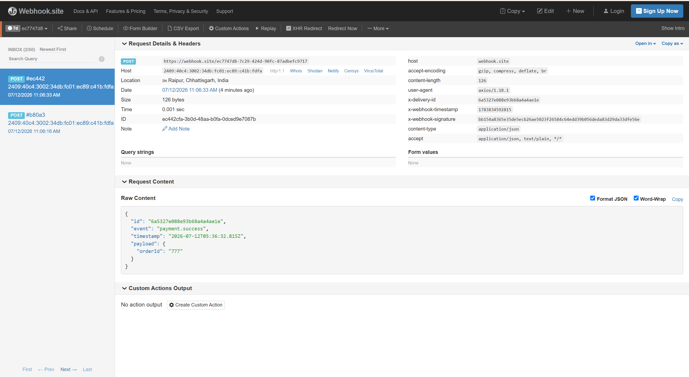

# WebhookRelay

A reliable webhook delivery system built with Node.js. Producers send events to the API, and WebhookRelay makes sure they reach the subscriber's URL — signed, retried if they fail, and logged at every step.



## Why I built this

When one service calls another service's URL to notify it about something (like "payment done"), and that receiver is down at that moment, the notification is just lost. Nobody knows it failed. I wanted to build the piece of infrastructure that solves this — the same thing Stripe and Razorpay run internally for their webhooks. So the guarantee here is at-least-once delivery: an event will keep retrying until it lands, or it goes to a dead-letter state where you can see it and replay it manually.


## Architecture

```
  Producer (API key)                     Subscriber endpoints
        |                                      ^
        v                                      | HTTPS + HMAC-SHA256
  +-----------+    +---------+    +---------+  | headers: signature,
  |   API     |--->| MongoDB |    | Worker  |--+ timestamp, delivery-id
  | (Express) |    +---------+    | (BullMQ)|
  |           |--->+---------+--->|         |  fail -> retry x5 (exponential backoff)
  +-----------+    |  Redis  |    +---------+  exhausted -> dead-letter
   JWT: manage     |  queue  |                 dead -> replay via API
   endpoints/logs  +---------+
```

Two processes run from one codebase — the API server and the delivery worker. The API takes events in and puts delivery jobs on a Redis queue (BullMQ). The worker picks them up and does the actual HTTP delivery.

## Features

- **HMAC-SHA256 signed payloads** — every delivery has a signature header, so the receiver can verify it really came from us and wasn't tampered with
- **Retries with exponential backoff** — 5 attempts with growing delays before giving up
- **Dead-letter + replay** — permanently failed deliveries are marked dead, every attempt is logged, and you can replay them from the API
- **Idempotent event ingestion** — sending the same event twice (same idempotencyKey) creates it only once, enforced at the database level with a unique index
- **Auto-disable** — an endpoint that keeps failing (10 dead deliveries in a row) gets disabled automatically
- **Dual authentication** — JWT for managing endpoints and viewing logs, API keys for producers sending events
- **Rate limiting** — separate limits for auth routes and general API
- **Swagger docs** — full API documentation at `/docs`
- **Test suite** — 11 Jest tests covering signatures, auth, idempotency, and the full ingestion flow

## Quick start

You need Docker installed. Then:

```bash
docker compose up --build
```

This starts 4 services: api (port 5000), worker, MongoDB and Redis.

Then seed demo data (creates a user, an endpoint, and fires 3 sample events):

```bash
docker compose exec api node scripts/seed.js
```

The seed prints a token and API key you can use. Open http://localhost:5000/docs/ to explore the API. To watch deliveries actually land somewhere, get a free URL from webhook.site and pass it while seeding with the SEED_WEBHOOK_URL env variable.

## How retries work

When the worker delivers to a URL and gets anything that isn't a 2xx (or a timeout / network error), it records the attempt and throws. BullMQ catches that throw, waits with exponential backoff (30s, then longer and longer), and retries — up to 5 times. If all 5 fail, the delivery is marked dead and the endpoint's failure counter goes up. Dead deliveries keep their full attempt history and can be replayed with a fresh attempt budget from the API — the old attempts stay in the log, new ones get appended.

## Challenges I faced

- **Two apps fighting for port 5000.** During testing my health endpoint suddenly returned a different response shape. Turned out another project's dev server was still running on the same port and answering instead of this one. Diagnosed it by noticing the error format didn't match my code, then killed the stale process.
- **Windows not passing inline env vars through npm.** I wanted to run the worker with a faster retry delay for testing (`BACKOFF_DELAY_MS=2000 npm run worker`) but on Windows the variable never reached the process. Fixed it by running `node src/worker.js` directly with the env set for that process.
- **Jest hanging after tests passed.** The test run never exited because BullMQ and Redis connections stayed open. Fixed with proper teardown in `afterAll` — close the queue, quit Redis.
- **A "crash" that wasn't a crash.** During Docker verification the api container appeared to stop by itself. After digging through logs and container metadata it turned out my own teardown command had raced with a still-running verification script. The investigation still ended up making the system better — I added a restart policy and explicit Redis/Mongo error handlers so real crashes recover automatically.

## Tests

```bash
npm test
```

11 tests across 4 suites — signature sign/verify with tamper detection, auth flows, idempotency, and an end-to-end ingestion test. Tests run against an in-memory MongoDB, so they never touch real data.

## Stack

Node.js, Express, MongoDB (Mongoose), Redis, BullMQ, JWT, Zod, Jest, Docker